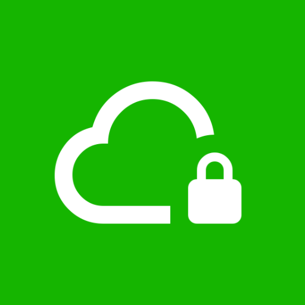

<p align="center"></p>
<h1 align="center"><b>Capsule for Android</b></h1>
<h4 align="center">Send and receive files privately, straight from your Android device</h4>
<p align="center">
    <a href="https://github.com/Seanathan10/Android/releases">
        
    </a>
    
</p>

## Screenshots

[](https://docs.withcapsule.dev/images/android/Android_Send.png)
[](https://docs.withcapsule.dev/images/android/Android_Receive.png)
[](https://docs.withcapsule.dev/images/android/Android_History.png)
[](https://docs.withcapsule.dev/images/android/Android_Settings.png)

## Features

* Upload files directly or via the system share sheet
* Download files by ID or QR code scan
* Optional client-side end-to-end encryption with a BIP39 mnemonic passphrase
* QR code display after upload for easy sharing
* Upload history with time remaining per file
* Self-hosted server support, including LAN
* Dark, light, and system theme
* Anonymous opt-out analytics

## Building

```sh
./gradlew installDebug      # build and install on a connected device/emulator
```

## Documentation

Full documentation lives at [docs.withcapsule.dev](https://docs.withcapsule.dev).

See [PRIVACY_POLICY.md](PRIVACY_POLICY.md) for how the app handles data.
